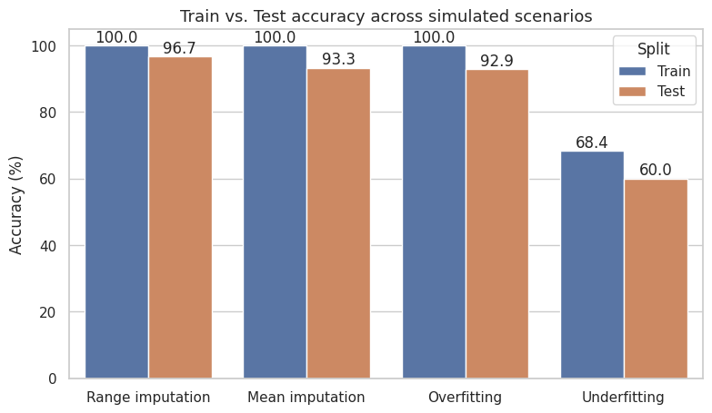

# iris-imputation-stress-lab
 


 


<center><a href="https://archive.ics.uci.edu/dataset/53/iris"> Iris dataset</a></center>


**Stress-testing the Iris dataset:** two missing-data imputation strategies plus simulated overfitting and underfitting, measured on a decision tree.
 
## Overview
 
The Iris dataset is almost always used in its pristine form, which hides the failure modes you actually meet in production. This lab deliberately breaks it in four different ways and measures what each break does to a `DecisionTreeClassifier`.
 
Every scenario reloads the dataset from scratch, so the experiments are independent and can be run in any order.
 
## Tasks
 
1. **Remove 25 samples from each species** (setosa, versicolor, virginica) and design a strategy to regenerate that data artificially, simulating a missing-data scenario.
2. **Fill the gaps using each species' mean**, as a second missing-data strategy.
3. **Modify the dataset to simulate overfitting** the model sees many examples of a single species.
4. **Modify the dataset to simulate underfitting** the model sees few examples of each species.
## Approach
 
### 1. Range-based imputation
 
Half of each species (25 of 50 rows) is wiped to `NaN`. The strategy then assumes no prior knowledge of the removed values: it looks only at the surviving rows, takes the observed minimum and maximum of each column *within that species*, and draws uniformly from that interval. Generated values therefore stay inside a plausible range for the feature and the species, instead of being pulled from the global distribution.
 
### 2. Mean-based imputation
 
Same removal, but every gap in a column is filled with that column's mean for the species, the textbook baseline that range imputation is being compared against.
 
### 3. Simulated overfitting
 
Setosa keeps all 50 real samples while versicolor and virginica are cut down to 10 each. The classes are genuinely imbalanced (70 rows total, ~71% setosa), so the tree has abundant evidence for one class and almost none for the other two.
 
### 4. Simulated underfitting
 
All three species are reduced to 8 real samples each, **and** the tree is capped at `max_depth=1`. The depth cap is the part that actually forces underfitting: with a single split and three classes, the model cannot separate them no matter how clean the data is. Scarcity alone is not enough on a problem this easy.
 
## Results
 
| Scenario | Strategy | Train | Test |
|---|---|---|---|
| Range imputation | Uniform draw within the species' observed min–max | `100.0%` | `96.7%` |
| Mean imputation | Species column mean | `100%` | `93.3.0%` |
| Overfitting | 50 setosa vs. 10 of each other species | `100%` | `92.9%` |
| Underfitting | 8 samples per species + `max_depth=1` | `68.4%` | `60.0%` |
 
*Fill in the remaining values from your own run, sampling inside each scenario is still random, so numbers shift slightly between executions.*
 
 
## Stack
 
- Python 3
- scikit-learn -> `load_iris`, `DecisionTreeClassifier`, `train_test_split`, `accuracy_score`
- NumPy, pandas
- Matplotlib, seaborn
## Running it
 
```bash
git clone https://github.com/Korzre/iris-imputation-stress-lab.git
```
 
Open `iris_imputation_stress_lab.ipynb`
 
 

